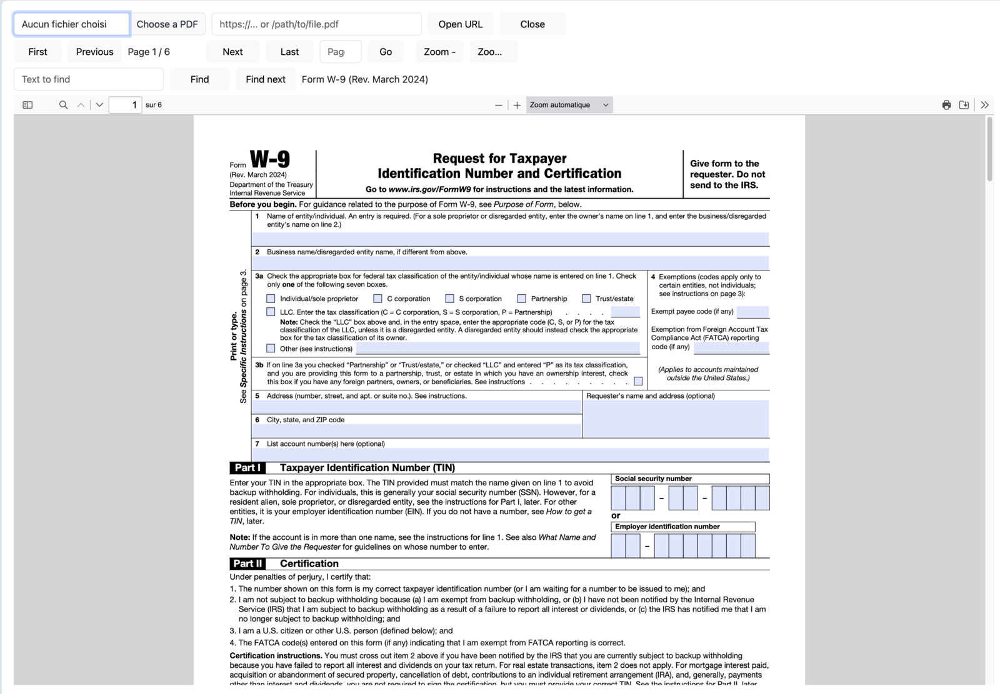
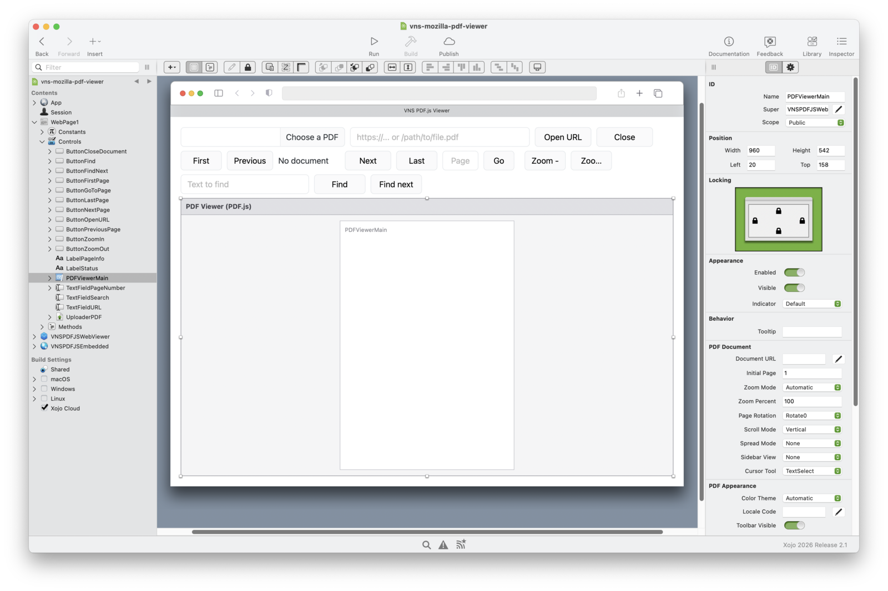
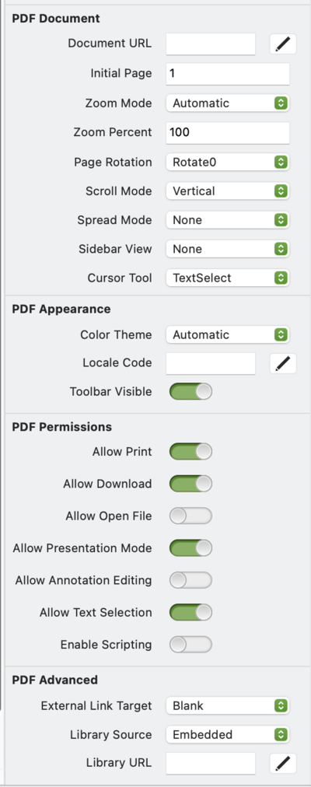

# VNS PDF.js Web Viewer for Xojo

A Xojo Web 2.0 control that displays PDF files in the browser with
[Mozilla PDF.js](https://mozilla.github.io/pdf.js/) — the viewer built into Firefox.
Drop `VNSPDFJSWebViewer` on a web page, set its properties in the Inspector, and call
`LoadFromFile`. No JavaScript to write, no Node.js, no build step: PDF.js ships inside
the control.



## Features

- **The same PDF display in every browser.** Instead of each browser's own PDF viewer (different
  in Chrome, Edge, Safari and Firefox, missing in some mobile browsers), every user gets the same
  viewer, with the same look, toolbar, features and the settings you chose in Xojo.
- The full PDF.js viewer: thumbnails, outline (bookmarks), attachments and layers sidebar,
  text search, zoom, rotation, scroll and spread modes, presentation mode, printing,
  download, fillable forms, text selection, CJK and right-to-left text.
- 22 properties in the Xojo Inspector (page, zoom, layout, sidebar, theme, language,
  toolbar, permissions) — no code needed for the common cases.
- Load from a `FolderItem`, a `MemoryBlock` (e.g. a PDF made with VNS fPDF or fetched from a
  database) or a URL. Files are served by the control itself, only to the session that
  displays them.
- Navigation, zoom, rotation, print, download and search methods; events for document
  loaded, page changed, zoom changed, rotation changed, search results and load errors.
- PDF.js can come from three places: embedded in the app (default, works offline),
  a folder copied next to the app, or the jsDelivr CDN.
- Permissions: hide/disable printing, download, opening other files, presentation mode,
  annotation editing, text selection. PDF JavaScript is off by default.
- Light / dark / automatic theme, and the viewer's 100+ interface languages.

## In the Xojo IDE

The control appears in the Library and on the page like any other control; its PDF settings are
grouped in the Inspector.





## Requirements

- Xojo 2024r3 or later (the embedded library needs `MemoryBlock.Decompress`).
  Developed and tested with Xojo 2026r2.1 only.
- A Xojo Web 2.0 project. Any modern browser (PDF.js 6 needs a current Chrome, Edge,
  Firefox or Safari).

## Installation

1. Copy into your project folder, then drag into the Xojo navigator:
   - `VNSPDFJSWebViewer.xojo_code` — the control
   - `VNSPDFJSEmbedded.xojo_code` — PDF.js 6.4.299, compressed (4.7 MB)
2. In your `App`, add the `HandleURL` event so the app can serve PDF.js:

   ```xojo
   Function HandleURL(request As WebRequest, response As WebResponse) As Boolean
     If VNSPDFJSWebViewer.HandleLibraryRequest(request, response) Then
       Return True
     End If
     Return False
   End Function
   ```

3. Drag a `VNSPDFJSWebViewer` from the Library onto a web page.

That's all for the default `Embedded` source. For the two other sources, see
[Where PDF.js comes from](docs/DEVELOPER_GUIDE.md#where-pdfjs-comes-from).

## Usage

```xojo
// A file on the server
PDFViewerMain.LoadFromFile(SpecialFolder.Documents.Child("report.pdf"))

// A PDF in memory, e.g. generated with VNS fPDF or read from a database
PDFViewerMain.LoadFromData(pdfData, "invoice-2026-001.pdf")

// A URL (another server must send CORS headers)
PDFViewerMain.LoadFromURL("https://example.com/manual.pdf")

// Drive the viewer
PDFViewerMain.GoToPage(12)
PDFViewerMain.ZoomMode = VNSPDFJSWebViewer.eZoomMode.PageWidth
PDFViewerMain.Find("invoice", True)
```

In the control's `DocumentLoaded(pageCount As Integer, title As String)` event:

```xojo
LabelInfo.Text = title + " — " + pageCount.ToString + " pages"
```

The full list of properties, methods and events is in the
[developer guide](docs/DEVELOPER_GUIDE.md).

## Demo project

`vns-mozilla-pdf-viewer.xojo_project` is a demo: choose a PDF to upload or open a URL, then
navigate (first, previous, next, last, go to page), zoom and search the text.

## License

MIT — see [LICENSE](LICENSE). PDF.js is © Mozilla and contributors, under the
Apache License 2.0 ([pdfjs/LICENSE](pdfjs/LICENSE)).

Made by Jean-Yves Pochez (VeryniceSW). Also by the same
author: [VNS fPDF](https://github.com/JYPochez/Xojo-VNS-fpdf-Library), a PDF
*generation* library for Xojo with full Unicode support.
